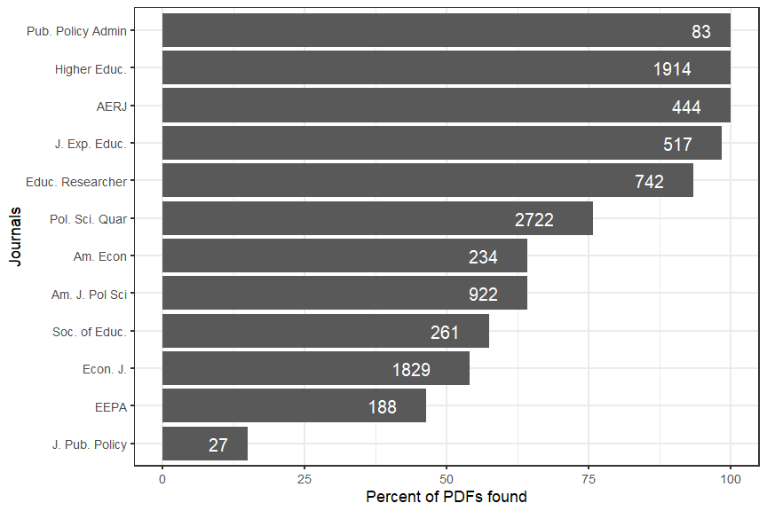
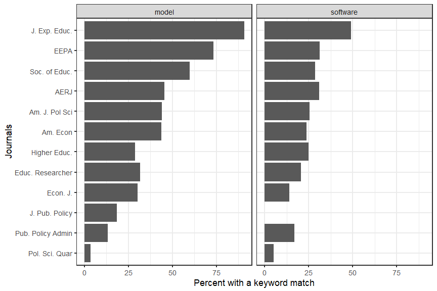
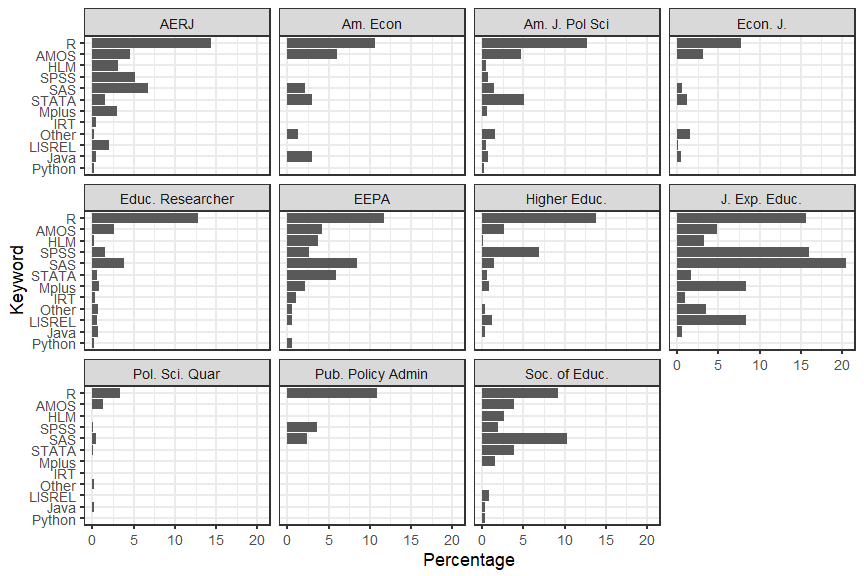
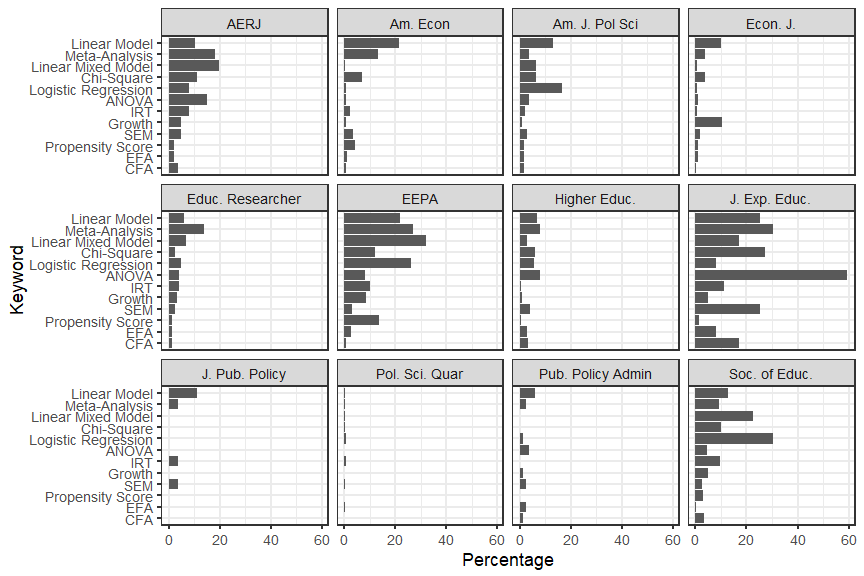
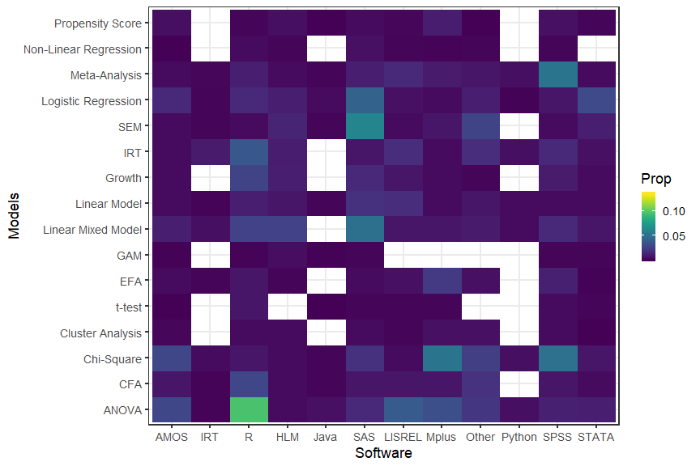
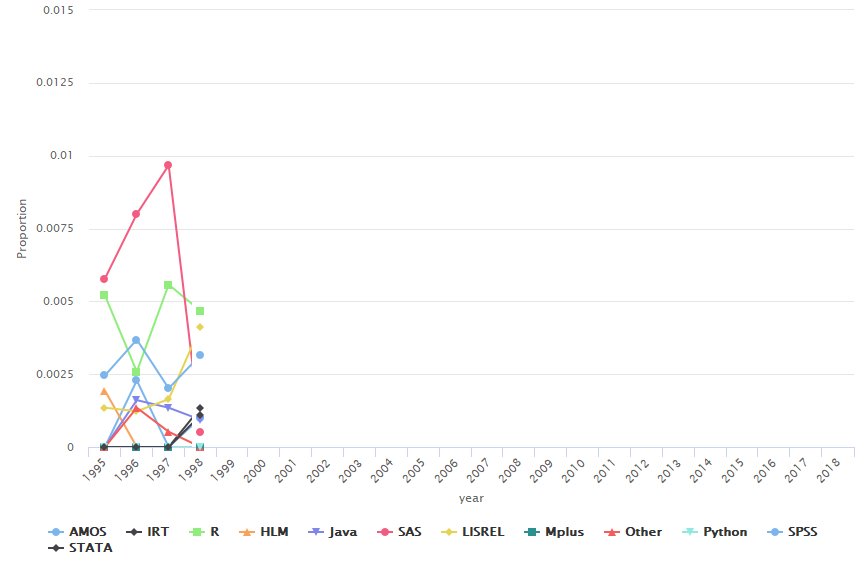
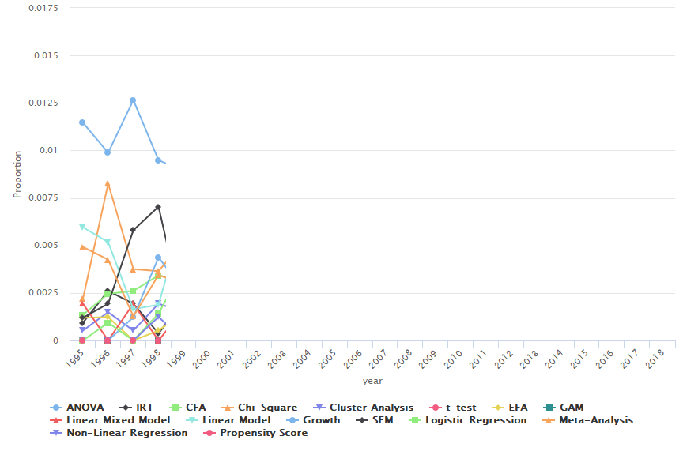

# Rationale

- Extension of work done by Robert Muenchen (http://r4stats.com/articles/popularity/). 
    + Focus is on statistical software
    + Addition of quantitative methods
    + Particularly interested in the interaction.
- Questions of Interest:
    + Exploring which software is popular in published research. 
    + How many empirical analyses cite software?
    + Any patterns in software use with quantitative methods?

# Methods
- Research synthesis methods were used
- Web of Knowledge was used to pull in citations for 12 social science journals
    - 1995 to 2018
- EndNote's "Find Text" feature was used to pull in PDFs of all articles from the journals
- `pdfsearch` R package was used to perform keyword searching.

# Software Keywords

| Keyword Group | Keywords | 
|---------------|----------|
| AMOS          | AMOS     |
| IRT           | BILOG; BILOG-MG; IRT PRO; MULTILOG; PARSCALE | 
| R             | CRAN; R-project; R Project; R Core Team; R software; RStudio | 
| HLM           | HLM [0-9]; HLM[0-9] | 
| Java          | Java  |
| SAS           | SAS; SAS Institute; JMP |
| LISREL        | LISREL |
| Mplus         | Mplus; M-Plus |
| Python        | Python |
| SPSS          | SPSS; SPSS Statistics | 
| STATA         | STATA |
| Other         | Matlab; Scala; Systat; Statistica; Tableau; Minitab |

# Method Keywords 

| Keyword Group | Keywords | 
|---------------|----------|
| ANOVA         | Analysis of Variance; ANOVA; Analysis of Covariance; ANCOVA; MANOVA; Multivariate Analysis of Variance; Repeated Measures Analysis of Variance; RM-ANOVA | 
| IRT           | IRT; Item Response Theory |
| CFA           | CFA; Confirmatory Factor Analysis |
| Chi-Square    | Chi-square( analysis)?; Nonparametric Analysis | 
| Cluster Analysis | Cluster Analysis; Hierarchical Cluster Analysis | 
| t-test        | Dependent Samples t-test; one-sample t-test; two-sample t-test | 
| EFA           | EFA; Exploratory Factor Analysis | 
| GAM           | GAM; Generalized additive models | 

# Method Keywords Continued

| Keyword Group | Keywords | 
|---------------|----------|
| Linear Mixed Model | LMM; HLM; Multilevel Model; Multi-level Model; Hierarchical Linear Model; General(ized)? Linear Mixed Model | 
| Linear Model | Linear Regression; Multiple Linear Regression; Multiple Regression; General(ized)? Linear Model |
| Growth       | Growth Model; Latent Growth Model; LGM | 
| SEM          | Latent Variable Modeling; SEM; Structural Equation Modeling | 
| Logistic Regression | Logistic Regression; Multinomial Regression; Multinomial Logistic Regression; Ordinal Regression | 
| meta-analysis | meta-analysis; meta analysis |
| Non-Linear Regression | Non-Linear Regression; Nonlinear Regression |
| Propensity Score | Propensity Score Analysis; Propensity score matching |

# Journals and Number of Articles

# Articles with at least one match

# Software Keywords

# Method Keywords

# Software and Methods

# Software over Time

# Model over Time

